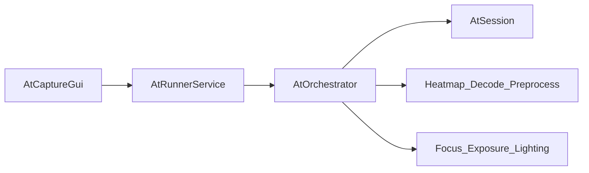

# AT 顶层设计

> 版本：1.0（Gate-0 冻结）  
> 对齐：[AT_REFACTOR_ARCHITECTURE_RFC_V1.md](../../AT_REFACTOR_ARCHITECTURE_RFC_V1.md)  
> 迁移：[LEGACY_MIGRATION_MAP.md](./LEGACY_MIGRATION_MAP.md)

## 1. 目标

在 `legacy/` 只读冻结的前提下，从零建立可测试、可 trace 的 AT 主线：

- 最小可运行：**曝光、对焦、补光** 三调节（实现可先简化）。
- 扩展槽：`heatmap`、`decode`、`preprocess`（首版可用 Null/Simple）。
- **runner 非交付物**：仅镜像 I/O；算法在 AT 库内。

## 2. 命名原则（冻结）

- 不使用 `v2` 目录或类型后缀。
- 新主线：`include/at_*.h` + `src/{core,orchestrator,providers}`；旧代码在 `legacy/`。

## 3. 分层



| 层 | 路径 | 职责 |
|----|------|------|
| ATCore | `src/core/` | `AtSession` 状态机、预算、候选、trace；无 SDK |
| ATLibrary | `src/orchestrator` + `providers` + `modules` | 编排、观测注入、decode 回填 |
| AtRunnerService | `apps/at_runner/` | 采图、设参、协议转发 |
| legacy | `legacy/` | 只读参考 |

## 4. v0 主路径（冻结）

```text
FocusTuneWithCoarseExposure
  -> ExposurePerLightProfile
  -> CandidateDecodeRanking (optional)
  -> SelectBest
  -> Done
```

内部阶段 `Observe` 用于统一质量采样，不暴露给 GUI。

### 4.1 面向解码的调节流程（v5.4，阶段枚举不变）

`FocusTuneWithCoarseExposure` 内部细分为四个子阶段，全部在
`src/core/at_session.cpp` 实现，公共契约与阶段枚举不变：

```text
CoarseSweep   对焦前先把亮度收敛到就绪窗口中值（比例式 AE，见下），
              然后整遍等距粗对焦扫描（不依赖检测模块，普通设备可用）；
              全程每帧检测码区，连续 kRoiLockHits(3) 帧 IoU >= 0.5
              即锁定并立即转入 FineSweep（"立即用目标 ROI 精调"）。
FineSweep     围绕最佳清晰度位置 ±half 窗口等距精扫（中心进入时锁存，
              不随精扫自身漂移）；已锁定时先基于 ROI 测光收敛曝光，
              再按 ROI 清晰度精调。
ProbeDark     精扫结束仍未锁定、且设备具备检测能力（配置了检测模型或
ProbeBright   出现过检测观测）时：把亮度压到暗区 / 抬到亮区各驻留数帧，
              探测"更暗/更亮才可见"的码区；探针期间一旦锁定，跳回
              FineSweep 精调后直接进入曝光阶段（跳过剩余探针）。

ExposurePerLightProfile  逐补光灯组合做传统 AE；锁定后按码区 ROI 测光，
                          焦点钉在 ROI 清晰度最优位置；检测持续运行，
                          允许此阶段后补锁定。
CandidateDecodeRanking   可选：以 decode 预算 + 少量等待帧为上限请求解码
                          验证，超时放弃排名（不烧全局预算）。
```

比例式 AE：亮度近似正比于 exp_time × gain，单步按 target/brightness
比例更新（上限 4x），增亮优先加曝光时间、减亮优先降增益（低增益优先，
控噪声）；饱和超限时强制回退。

候选评分面向解码：解码成功绝对支配；未解码时按 ROI 清晰度(0.30)、
对比度(0.20)、灰度熵(0.15)、亮度窗口(0.15)、检测置信(0.20) 加权，
饱和占比(0.25) 惩罚。

实现约束：不改 `include/at_*.h`（ABI/API 冻结），新增状态一律复用既有成员
（`previous_roi_` = 锁定 ROI；`focus_tune_index` = 对焦子阶段编码；
`exposure_tune_index` = 子阶段内步数；`light_profile_index` 在精扫期间
暂存精扫中心）或从 `candidates_` 记录派生（连续命中数、连续曝光调整数、
探针驻留帧数、最佳清晰度帧）。

码区观测统一由 `YoloDetectProvider` 提供（`AT_WITH_YOLO_TENGINE`）：
`HeatmapConfig.model_path` 非空即加载 YOLO 模型；`threshold` 语义为置信度 (0,1]，
超出该范围时回落默认 0.25。`HeatmapObservation`/`HeatmapProvider` 等公共类型名
保留为冻结契约词汇；旧热图（hmap）实现路径已于 5.3.0 移除。

## 5. 转移表（表驱动）

| From | Guard | To |
|------|-------|-----|
| Start | always | FocusTuneWithCoarseExposure |
| FocusTuneWithCoarseExposure | sweep done | ExposurePerLightProfile |
| ExposurePerLightProfile | all light profiles done | CandidateDecodeRanking |
| CandidateDecodeRanking | disabled or ranking done | SelectBest |
| SelectBest | best picked | Done |
| Any | stop / budget | Done |

语义（RFC 对齐）：

- `processStep`：单步同步（`AtOrchestrator::ProcessStep`）。
- Stage budget：`perSession`（`SessionState::stage_step_count` 跨阶段累计，防循环）。
- No-op：非 Hold/Finish/RequestDecode 且参数不变 → trace `reason` 标记并降级。
- Decode gate：保守（质量就绪 + heatmap 置信 + budget）。

## 6. 契约（`include/at_*.h`）

详见 [SOURCE_LAYOUT.md](./SOURCE_LAYOUT.md)。

| 头文件 | 内容 |
|--------|------|
| `at_types.h` | `FrameContext`、`StepPhase`、`TuneAction`、`SessionConfig` |
| `at_trace.h` | `StepTrace`（`trace_version`）、`StepResult`、`CandidateRecord` |
| `at_session.h` | `AtSession`（`core/at_session.cpp`） |
| `at_orchestrator.h` | `AtOrchestrator` |
| `at_providers.h` | `HeatmapProvider`、`DecodeProvider`、`PreprocessPlugin` |

`trace_version` 初版：`1`（见 `at::kTraceVersion`）。

## 7. Trace 必填字段

`step_index`, `stage_step_count`, `trace_version`, `phase`, `action`, `reason`,  
`params_before` / `params_after`（经 `next_params` 与输入对比）, `quality`,  
`finish_reason`, `decode_used`, `decode_budget`, `active_max_steps`。

扩展位（可选快照）：`heatmap`, `decode`, `preprocess`, `budget`。

## 8. Runner 协议（允许重定义）

建议命令：`get_capabilities`, `reset_session`, `set_params`, `capture_frame`, `process_step`。

Runner **不**执行 heatmap/decode；由 `AtOrchestrator` 在库内完成。

## 9. Gate 定义

| Gate | 标准 |
|------|------|
| Gate-0 | 本文档 + 迁移映射评审通过 |
| Gate-1 | `legacy/` 迁移完成 + `at_core_unit_test` 编译链接 |
| Gate-2 | 三调节主路径单测跑通（合成图） |
| Gate-3 | decode 排名可开关（后续） |
| Gate-4 | 固定 trace 回放（后续） |

## 10. 与 RFC 差异说明

RFC §3.4 仍描述旧默认流 `BrightnessPrecondition -> FocusExplore -> LocalRefine`；**本设计为 v0 主路径权威**，后续 RFC 修订应与此对齐。
