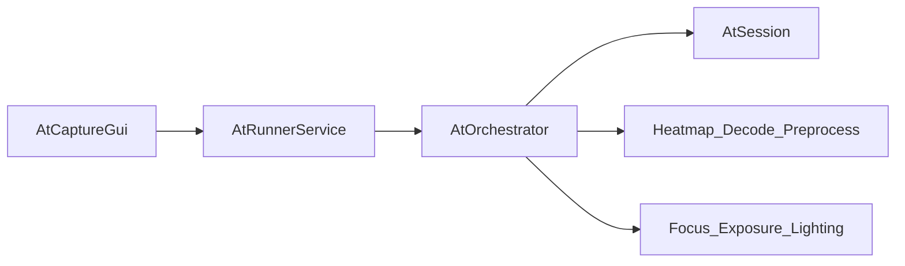

# AT 顶层设计

> 版本：1.0（Gate-0 冻结）  
> 对齐：[AT_REFACTOR_ARCHITECTURE_RFC_V1.md](../../AT_REFACTOR_ARCHITECTURE_RFC_V1.md)  
> 迁移：[LEGACY_MIGRATION_MAP.md](./LEGACY_MIGRATION_MAP.md)

## 1. 目标

在 `legacy/` 只读冻结的前提下，从零建立可测试、可 trace 的 AT 主线：

- 最小可运行：**曝光、对焦、补光** 三调节（实现可先简化）。
- 扩展槽：`heatmap`、`decode`、`preprocess`（首版可用 Null/Simple）。
- **runner 非交付物**：仅镜像 I/O；算法在 AT 库内。

## 2. 命名原则（冻结）

- 不使用 `v2` 目录或类型后缀。
- 新主线：`include/at_*.h` + `src/{core,orchestrator,providers}`；旧代码在 `legacy/`。

## 3. 分层



| 层 | 路径 | 职责 |
|----|------|------|
| ATCore | `src/core/` | `AtSession` 状态机、预算、候选、trace；无 SDK |
| ATLibrary | `src/orchestrator` + `providers` + `modules` | 编排、观测注入、decode 回填 |
| AtRunnerService | `apps/at_runner/` | 采图、设参、协议转发 |
| legacy | `legacy/` | 只读参考 |

## 4. v0 主路径（冻结）

```text
FocusTuneWithCoarseExposure
  -> ExposurePerLightProfile
  -> CandidateDecodeRanking (optional)
  -> SelectBest
  -> Done
```

内部阶段 `Observe` 用于统一质量采样，不暴露给 GUI。

## 5. 转移表（表驱动）

| From | Guard | To |
|------|-------|-----|
| Start | always | FocusTuneWithCoarseExposure |
| FocusTuneWithCoarseExposure | sweep done | ExposurePerLightProfile |
| ExposurePerLightProfile | all light profiles done | CandidateDecodeRanking |
| CandidateDecodeRanking | disabled or ranking done | SelectBest |
| SelectBest | best picked | Done |
| Any | stop / budget | Done |

语义（RFC 对齐）：

- `processStep`：单步同步（`AtOrchestrator::ProcessStep`）。
- Stage budget：`perSession`（`SessionState::stage_step_count` 跨阶段累计，防循环）。
- No-op：非 Hold/Finish/RequestDecode 且参数不变 → trace `reason` 标记并降级。
- Decode gate：保守（质量就绪 + heatmap 置信 + budget）。

## 6. 契约（`include/at_*.h`）

详见 [SOURCE_LAYOUT.md](./SOURCE_LAYOUT.md)。

| 头文件 | 内容 |
|--------|------|
| `at_types.h` | `FrameContext`、`StepPhase`、`TuneAction`、`SessionConfig` |
| `at_trace.h` | `StepTrace`（`trace_version`）、`StepResult`、`CandidateRecord` |
| `at_session.h` | `AtSession`（`core/at_session.cpp`） |
| `at_orchestrator.h` | `AtOrchestrator` |
| `at_providers.h` | `HeatmapProvider`、`DecodeProvider`、`PreprocessPlugin` |

`trace_version` 初版：`1`（见 `at::kTraceVersion`）。

## 7. Trace 必填字段

`step_index`, `stage_step_count`, `trace_version`, `phase`, `action`, `reason`,  
`params_before` / `params_after`（经 `next_params` 与输入对比）, `quality`,  
`finish_reason`, `decode_used`, `decode_budget`, `active_max_steps`。

扩展位（可选快照）：`heatmap`, `decode`, `preprocess`, `budget`。

## 8. Runner 协议（允许重定义）

建议命令：`get_capabilities`, `reset_session`, `set_params`, `capture_frame`, `process_step`。

Runner **不**执行 heatmap/decode；由 `AtOrchestrator` 在库内完成。

## 9. Gate 定义

| Gate | 标准 |
|------|------|
| Gate-0 | 本文档 + 迁移映射评审通过 |
| Gate-1 | `legacy/` 迁移完成 + `at_core_unit_test` 编译链接 |
| Gate-2 | 三调节主路径单测跑通（合成图） |
| Gate-3 | decode 排名可开关（后续） |
| Gate-4 | 固定 trace 回放（后续） |

## 10. 与 RFC 差异说明

RFC §3.4 仍描述旧默认流 `BrightnessPrecondition -> FocusExplore -> LocalRefine`；**本设计为 v0 主路径权威**，后续 RFC 修订应与此对齐。
